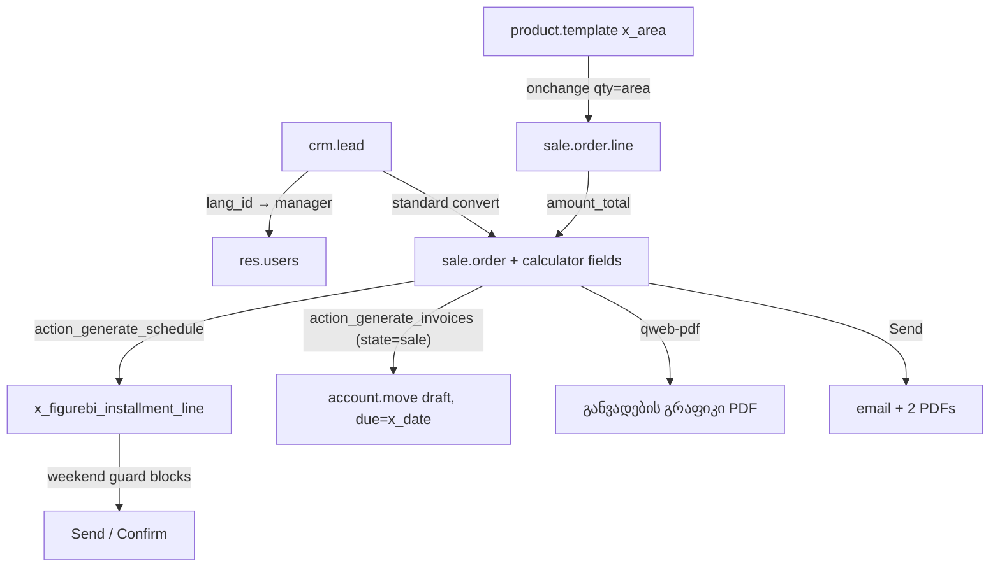

<!-- last-synced: 2026-09-03, commit: 345d4d9 -->
# Architecture — figurebi_installment

## Components
| component | file | responsibility |
|---|---|---|
| Calculator core | models/sale_order.py | params, 5-way discount sync, schedule generation, guards, invoices, PMT |
| Schedule line | models/installment_line.py | one payment row: date/amount/balance/weekend/purple |
| Area autofill | models/sale_order_line.py, product_template.py | x_area → qty |
| CRM routing | models/crm_lead.py | lead → manager by language |
| Settings | models/res_config_settings.py | manager ids as ir.config_parameter |
| UI | views/sale_order_views.xml (+ scss asset) | calculator tab, cards, buttons, list decorations |
| PDF | report/installment_report.xml | client-facing schedule (qweb-pdf) |
| Email | data/mail_template_data.xml | Georgian override of sale.email_template_edi_sale |

## Data flow

| from | to | via |
|---|---|---|
| discount inputs (%, $/m², $, final m², final total) | order_line.discount | onchange (UI) / inverse on the two final fields (RPC too) |
| order_line.discount | amount_total → x_final_total | standard sale computes + module computes |
| schedule lines | account.move | action_generate_invoices, origin = order name |
| ir.config_parameter figurebi.* | crm.lead.user_id | _figurebi_assign_by_lang |

## Extension points
- Inherited core models: sale.order, sale.order.line, product.template, crm.lead, res.config.settings
- Overridden methods: sale.order.write (weekend guard), x_figurebi_installment_line.write (purple clear), crm.lead.create/write
- No controllers, no crons, no external APIs
- Reads `vk_area_total` from the third-party `vertikali` module when present (soft dependency via getattr)

## Deployment topology
- On-premise (production): the Python module in `/opt/odoo/custom-addons`; deploy = pscp + sudo cp + restart + RPC upgrade
- Odoo.sh staging (demo): same behavior rebuilt as manual x_ records via `scripts/*.ps1` (no module; the two must never meet on one DB)
- SaaS fallback: `figurebi_installment_data` (XML/CSV only, untested)
